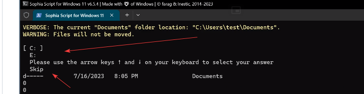

Menu w PowerShell po którym można poruszać się strzałkami.

- https://qna.habr.com/answer?answer_id=1522379

```powershell
function ShowMenu([array]$Menu, [int]$Default)
{
  $minY = [Console]::CursorTop
  $y = [Math]::Max([Math]::Min($Default, $Menu.Count), 0)
  do {
    [Console]::CursorTop = $minY
    [Console]::CursorLeft = 0
    $i = 0
    foreach ($item in $Menu) {
      $colors = @{
         BackgroundColor = if ($i -ne $y) { [Console]::BackgroundColor } else { 'Cyan' }
         ForegroundColor = if ($i -ne $y) { [Console]::ForegroundColor } else {' Blue' }
      }
      Write-Host (' {0}. {1} ' -f ($i+1), $item) @colors
      $i++
    }
    $k = [Console]::ReadKey()
    switch ($k.Key) {
      'UpArrow' { if ($y -gt 0) { $y-- } }
      'DownArrow' { if ($y -lt ($menu.Count - 1)) { $y++ } }
      'Enter' { return $Menu[$y] }
    }
  } while ($k.Key -notin ([ConsoleKey]::Escape, [ConsoleKey]::Enter))
}

$Menu = 'test1','text2','menu3','result4'

ShowMenu $menu 2
```

I inna wersja zgapiona z Sophiascript:

- https://github.com/farag2/Sophia-Script-for-Windows/blob/bf920bf64d7a3088a5c92f716602f018e2354af5/src/Sophia_Script_for_Windows_10_LTSC_2019/Module/Sophia.psm1#L836



```powershell
	<#
		.SYNOPSIS
		The "Show menu" function with the up/down arrow keys and enter key to make a selection

		.PARAMETER Menu
		Array of items to choose from

		.PARAMETER Default
		Default selected item in array

		.PARAMETER AddSkip
		Add localized extracted "Skip" string from shell32.dll

		.EXAMPLE
		Show-Menu -Menu $Items -Default 1

		.LINK
		https://qna.habr.com/answer?answer_id=1522379
	#>
	function script:Show-Menu
	{
		[CmdletBinding()]
		param
		(
			[Parameter(Mandatory = $true)]
			[array]
			$Menu,

			[Parameter(Mandatory = $true)]
			[int]
			$Default,

			[Parameter(Mandatory = $false)]
			[switch]
			$AddSkip
		)

		Write-Information -MessageData "" -InformationAction Continue

		# Add "Please use the arrow keys 🠕 and 🠗 on your keyboard to select your answer" to menu
		$Menu += $Localization.KeyboardArrows -f [System.Char]::ConvertFromUtf32(0x1F815), [System.Char]::ConvertFromUtf32(0x1F817)

		if ($AddSkip)
		{
			# Extract the localized "Skip" string from shell32.dll
			$Menu += [WinAPI.GetStr]::GetString(16956)
		}

		# https://github.com/microsoft/terminal/issues/14992
		[System.Console]::BufferHeight += $Menu.Count
		$minY = [Console]::CursorTop
		$y = [Math]::Max([Math]::Min($Default, $Menu.Count), 0)

		do
		{
			[Console]::CursorTop = $minY
			[Console]::CursorLeft = 0
			$i = 0

			foreach ($item in $Menu)
			{
				if ($i -ne $y)
				{
					Write-Information -MessageData ('  {1}  ' -f ($i+1), $item) -InformationAction Continue
				}
				else
				{
					Write-Information -MessageData ('[ {1} ]' -f ($i+1), $item) -InformationAction Continue
				}

				$i++
			}

			$k = [Console]::ReadKey()
			switch ($k.Key)
			{
				"UpArrow"
				{
					if ($y -gt 0)
					{
						$y--
					}
				}
				"DownArrow"
				{
					if ($y -lt ($Menu.Count - 1))
					{
						$y++
					}
				}
				"Enter"
				{
					return $Menu[$y]
				}
			}
		}
		while ($k.Key -notin ([ConsoleKey]::Escape, [ConsoleKey]::Enter))
	}
```