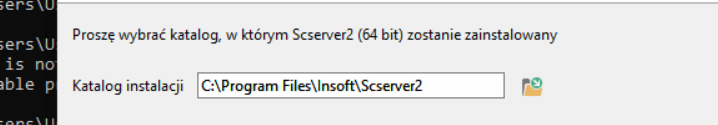

## PC-Market

Ustawienie bazy i użytkownika:

```
PCMWin.exe -cpar"Baza=pcmarket" -NoCparErr

PCMWin.exe -cpar"Baza=pcmarket;Id=ADMIN;Haslo=admin" -NoCparErr

PcmEDI.exe -cpar"Baza=pcmarket;Id=ADMIN;Haslo=admin" -NoCparErr -silent
```

## SCServer

`Scserver-x64.exe --instance 2` - instalacja kolejnej instancji SCServer



Wywołanie instalatora `SCserver-x64.exe --help` - lista parametrów:

```
Scserver 7.8.64.143
Sposób użycia:

 --help                                      Wyświetlenie listy prawidłowych opcji

 --version                                   Wyświetl informację o produkcie

 --unattendedmodeui <unattendedmodeui>       Unattended Mode UI
                                             Domyślnie: none
                                             Dopuszczalne: none minimal minimalWithDialogs

 --optionfile <optionfile>                   Installation option file
                                             Domyślnie: 

 --debuglevel <debuglevel>                   Debug information level of verbosity
                                             Domyślnie: 2
                                             Dopuszczalne: 0 1 2 3 4

 --mode <mode>                               Installation mode
                                             Domyślnie: win32
                                             Dopuszczalne: win32 unattended

 --debugtrace <debugtrace>                   Debug filename
                                             Domyślnie: 

 --enable-components <enable-components>     Comma-separated list of components
                                             Domyślnie: Scserver
                                             Dopuszczalne: sybaseodbc

 --disable-components <disable-components>   Comma-separated list of components
                                             Domyślnie: sybaseodbc
                                             Dopuszczalne: sybaseodbc

 --installer-language <installer-language>   Language selection
                                             Domyślnie: pl
                                             Dopuszczalne: pl

 --instance <instance>                       parametr umożliwia instalowanie kolejnej kopii scservera. Jako parametr należy podać kolejny numer kopii instancji. Uwaga! Podczas aktualizacji wybranej instancji należy uwzględniać ten parametr. Przykład wywołania: --instance <numer kolejnej instancji> np. --instance 2
                                             Domyślnie: 

 --service <service>                         parametr umożliwia wybór trybu pracy scservera (aplikacja/usługa). Domyślnie instalowany jest jako usługa. Parametry wywołania: --service 1 - usługa (domyślnie) --service 0 - aplikacja
                                             Domyślnie: 1

 --upgrade <upgrade>                         parametr umożliwia przygotowanie plików do automatycznej aktualizacji w centrali i na sklepach. Przykład wywołania: --upgrade 1 - tak nastąpi automatyczna aktualizacja, --upgrade 0 - nie (domyślnie), standardowa aktualizacja
                                             Domyślnie: 0

 --CzyAutoStartUslugi <CzyAutoStartUslugi>   Włącz automatyczne uruchamianie usługi Scserver
                                             Domyślnie: 1

 --JakiAutoStart <JakiAutoStart>             
                                             Domyślnie: mysql
                                             Dopuszczalne: mysql postgresql mssql brak

 --BazaIP <BazaIP>                           IP Serwera:
                                             Domyślnie: 

 --BazaPort <BazaPort>                       Port:
                                             Domyślnie: 3306

 --BazaNazwa <BazaNazwa>                     Nazwa bazy:
                                             Domyślnie: 

 --BazaSerial <BazaSerial>                   Nr seryjny bazy:
                                             Domyślnie: 

 --SerwerIp <SerwerIp>                       IP zdalnego Serwera:
                                             Domyślnie: 

 --SerwerPort <SerwerPort>                   Port:
                                             Domyślnie: 59999

 --SerwerTimeout <SerwerTimeout>             Timeout do nawiązania połączenia:
                                             Domyślnie: 360


```