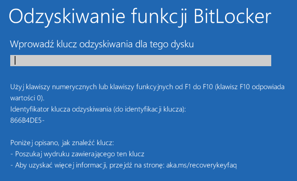
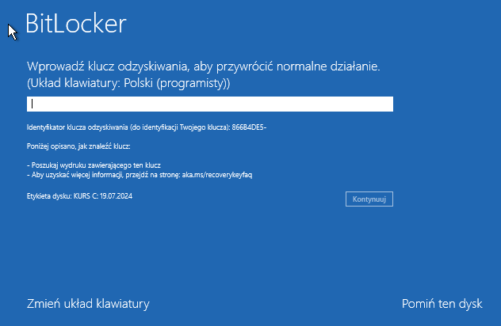
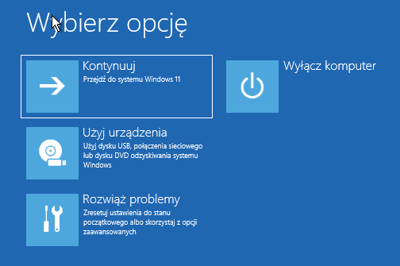
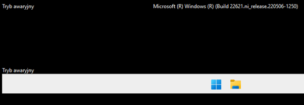

## Kopia z: https://blog.szurek.tv/post/jak-uruchomic-tryb-awaryjny-bez-klucza-odzyskiwania-bitlocker/

Ten opis bazuje na wpisie użytkownika [LetheTheForgotten](https://x.com/LetheForgot/status/1814203140842868797).

Standardowo jeśli używasz systemu [BitLocker](https://support.microsoft.com/pl-pl/windows/znajdowanie-klucza-odzyskiwania-funkcji-bitlocker-w-systemie-windows-6b71ad27-0b89-ea08-f143-056f5ab347d6), to próba przejścia do okna `odzyskiwanie funkcji BitLocker` wymaga podania **klucza odzyskiwania**.



Możesz spróbować uruchomić tryb awaryjny bez klucza odzyskiwania. W tym celu pomiń podawanie klucza odzyskiwania i wciśnij klawisz `Esc`.

W kolejnym oknie wybierz `Pomiń ten dysk`.



Wybierz `Rozwiąż problemy` a następnie `Opcje zaawansowane`.



Wciśnij `Wiersz polecenia`.


W linii komend podaj:

```bash
bcdedit /set {default} safeboot minimal
```

Uruchom komputer ponownie. Tym razem powinien uruchomić się w trybie awaryjnym - bez potrzeby podawania hasła odzyskiwania. Widać to w lewym górnym rogu ekranu po napisie `Tryb awaryjny`.



Teraz możesz usunąć sterowniki, które powodują problemy z systemem.

Po zakończeniu wymaganych prac klawiszem `WIN+R` uruchom okno `Uruchamianie` i wpisz w nim `cmd`.

Wyłącz tryb awaryjny używając:

```bash
bcdedit /deletevalue {default} safeboot
```

Uruchom komputer ponownie.
