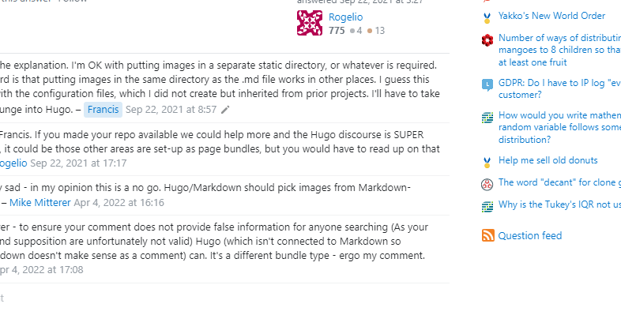
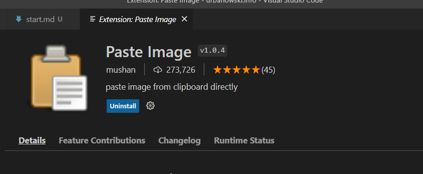

# Testowy wpis na dobry początek

Troche tekstu, pl znaczki ęóąśłżźćńĘÓĄŚŁŻŹĆŃ i jeszcze trochę tekstu

- lista
- z kolejnymi pozycjami 
- o t asdf
- asdfasdfas




```php
# komentarz
$Parsedown = new Parsedown();
echo $Parsedown->text('Hello _Parsedown_!'); 
# prints: <p>Hello <em>Parsedown</em>!</p>
```



Jeszcze jakis tekst i coś sdf sdfg sdfg sdfg s


No dobra to zobaczmy jak o wychodzi

